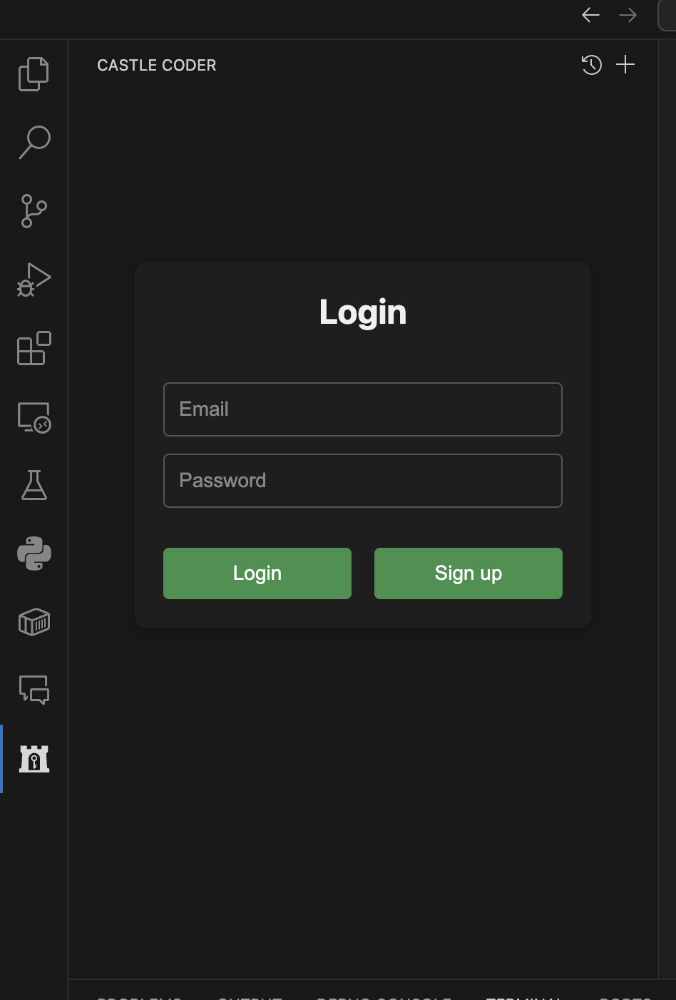
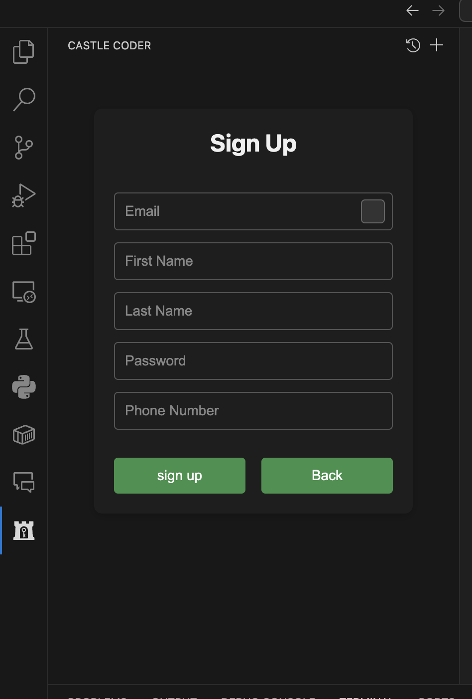
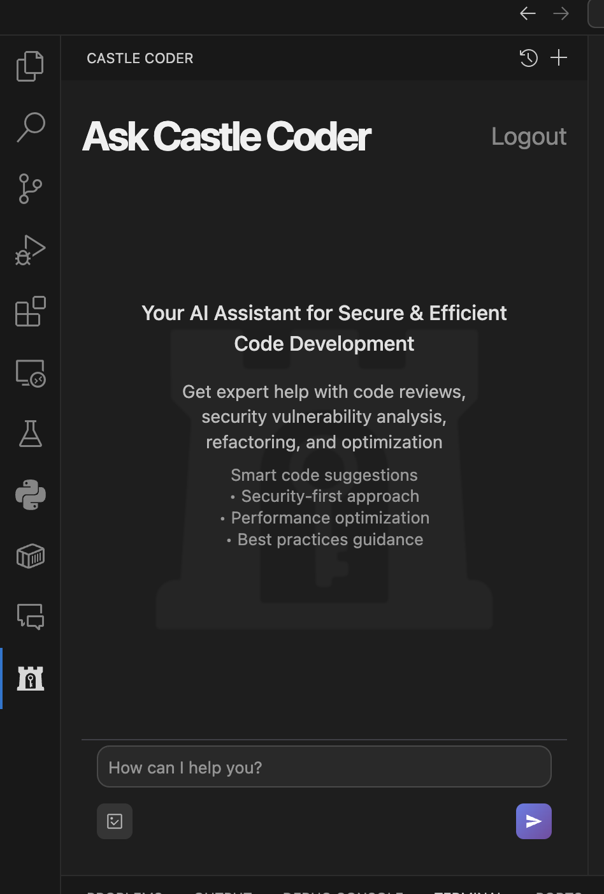
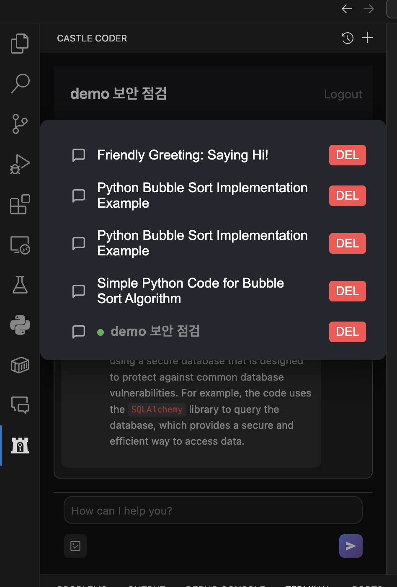

## Overview

**Login Screen** 
Enter your email and password to log in.
    

 

**Sign Up Screen** 
Fill in your email and password to create a new account.
    

 

**Main Page Overview** 

This is the main interface of the Castle Coder extension, where you can access all features. 
    
- On the main page, you can attach images to your requests.
- While a request is being processed, you can also cancel it at any time.
- By clicking the "+" button, you can open a new chat window.
- If you click the clock icon next to it, you can view all your previous chat records.

 

**Chatting Record** 
Here you can see a record of your previous chats and interactions.
    
- In the Chatting Record section, you cannot select the chat session that you are currently using.
- By clicking the Delete button, you can remove a chat record.
- The title of each chat session can be set or changed manually by the user.
- If you do not set a title, it will be automatically generated by summarizing the content of your chat.

## Demo

**How to Generate Code** 
<video controls>
    <source src="https://drive.google.com/file/d/1wdq7taxkSFxhZSxphgCzCWbcOQezvMqY/view?usp=sharing" type="video/mp4">
</video> 
To generate code, simply enter your desired functionality in the prompt. 
You can also specify a name for your code and select the technology stack you want to use. 
If you want to include an image, you can attach it as part of your request

**How to Refactor Code for Security** 
<video controls>
    <source src="https://drive.google.com/file/d/102eHWjWKBkVZxEgJ8hwQXFV1P41Bg08u/view?usp=sharing" type="video/mp4">
</video> 
To perform security refactoring, right-click on the code you want to improve and select the "Castle Coder: Security Refactoring" option from the context menu. 
The extension will analyze your code for vulnerabilities, apply security improvements, and provide you with both the refactored code and an explanation of the changes.

# survey

[survey : experience about 'Castle Coder'](https://docs.google.com/forms/d/e/1FAIpQLSclX3xUzi0s9K-pVpBKE36KTnpGT7jzBk340l6lxUL1N3kZwA/viewform?usp=dialog)

